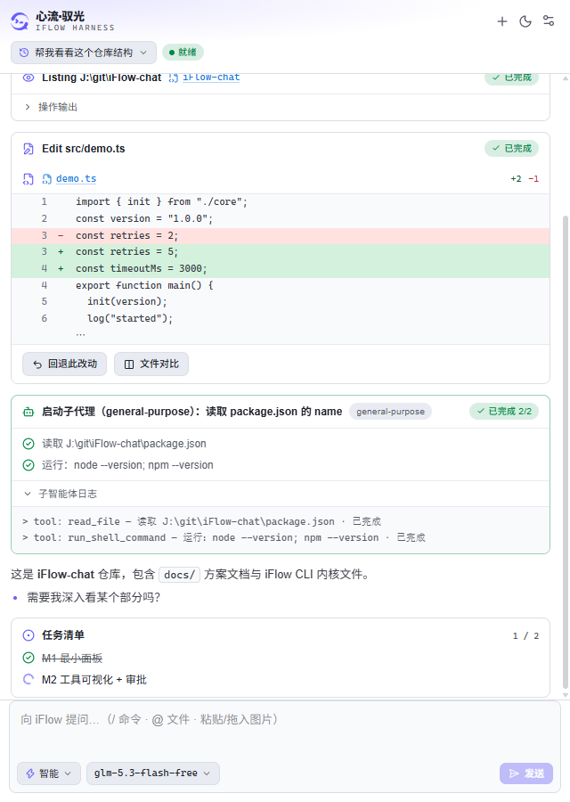
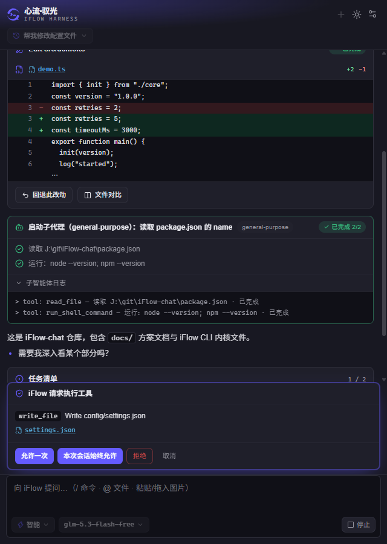
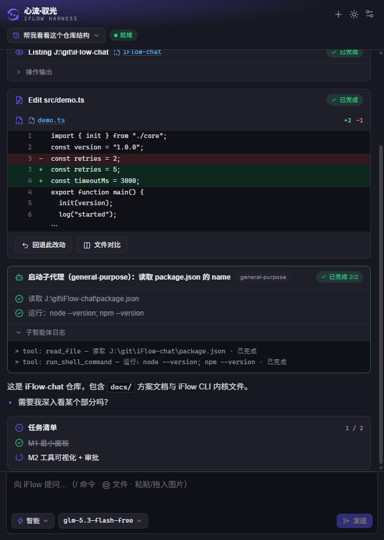

# iFlow Harness for VSCode

**心流·驭光** — iFlow CLI 的 VSCode 图形前端：通过 [ACP（Agent Client Protocol）](https://agentclientprotocol.com) 驱动本地 iFlow CLI，在编辑器标签页里完成对话、工具审批、代码评审与文件修改的完整 agent 工作流。



## 功能

**对话与生成**

- 流式对话：思考过程折叠、Markdown 渲染、一键中断
- 粘性「正在生成」指示器，生成期间切换类操作全量防呆禁用，操作消息防抖
- 子智能体卡片：按类型着色、步骤进度、本地化标题与日志面板


**工具与审批**



- 工具调用卡片：类型、状态、位置、输出结构化展示
- 行号 Diff 视图，支持一键 Revert 与 VSCode 原生并排对比（Open Diff）
- 审批流：请求卡片（允许一次 / 始终允许 / 拒绝），5 分钟超时自动拒绝，结果回写对话记录
- Revert 前对「编辑器有未保存修改」「磁盘内容与 diff 不一致」二次确认

**上下文与输入**

- `@文件补全`：输入框 `@` 触发工作区文件模糊搜索，键盘选择插入
- 选区上下文：编辑器右键 Ask iFlow（直接提问）/ Add to iFlow Context（注入输入框待编辑）
- 图片输入：粘贴或拖入图片作为附件，对话中缩略图回显，点击在 VSCode 内置预览打开
- Chat Participant：VSCode Chat 中 `@iflow` 纯文本通道，富交互仍在面板内

**会话与配置**

- 会话管理：历史会话切换 / 删除、重启 VSCode 后自动恢复上次会话、无标题会话以首条消息自动命名、恢复时自动滚动到底部
- API 配置：OpenAI 兼容凭据存 VSCode SecretStorage（不落盘明文、不入日志），多 Profile 切换自动重认证，生成期间禁用凭据变更
- 模型列表实时查询当前 endpoint 的 `/models`，不使用 CLI 内置硬编码目录
- 主题：深 / 浅色切换，默认跟随编辑器主题
- 状态栏：agent 状态（连接中 / 就绪 / 生成中 / 等待审批 / 出错）与当前模型一目了然，点击打开面板



## 前置要求

- VSCode `^1.90.0`
- 已安装 [iFlow CLI](https://www.npmjs.com/package/@iflow-ai/iflow-cli)（扩展会自动探测 PATH 与常见安装位置；也可在设置中指定）
- 可用的 OpenAI 兼容 API 端点（baseUrl + apiKey + modelName）

## 扩展设置

| 设置项 | 说明 |
|---|---|
| `iflow.cliPath` | iFlow CLI bundle `entry.js` 路径（留空自动探测） |
| `iflow.defaultMode` | 新会话默认权限模式：`smart` / `yolo` / `default` / `plan` |
| `iflow.nodePath` | 启动 CLI 使用的自定义 Node.js 可执行文件 |
| `iflow.idleTimeoutMinutes` | CLI 进程空闲多少分钟后回收 |

## 使用

1. 安装扩展后，点击状态栏右侧的 iFlow 状态项打开面板（也可用编辑器标签栏图标或命令面板 `iFlow: Open Chat Panel`）；面板是独立编辑器标签页，宽度可自由拖拽
2. 首次使用按提示配置 API 凭据（OpenAI 兼容地址 + Key + 模型名），或直接切换 CLI 已有的配置
3. 输入消息开始对话；工具调用会在面板中请求审批，Diff 卡片支持 Open Diff 与 Revert
4. Chat 视图中 `@iflow <问题>` 可走纯文本通道快速提问

## 开发

```bash
npm install
npm run build      # tsc 类型产出 + esbuild 打包 host + vite 构建 webview
npm run typecheck  # host 侧类型检查
npm test           # vitest（67 用例，含 mock ACP agent 集成测试，不依赖真实 CLI/API）
npm run harness    # 驱动真实 CLI 走 ACP 全流程（--record 录制 wire 日志）
npm run package    # 产出 .vsix
```

- F5 调试：`.vscode/launch.json` 提供扩展调试配置（Extension Development Host）；启动前先 `npm run build`，因为 `main` 指向 `./dist/extension.cjs`
- webview 侧类型检查：`cd webview && npx tsc --noEmit`
- webview 增量构建：`npm run webview:dev`
- 浏览器调试 webview：`webview/dist` 用任意静态服务器打开即可（内置 mock host，无需 VSCode）
- 新增 UI 文案请走 i18n：host 用 `vscode.l10n.t`（英文加 `l10n/bundle.l10n.en.json`），manifest 用 `%key%`（补 `package.nls*.json`），webview 用 `src/i18n.ts` 字典

## 发布

`CHANGELOG.md` 是版本的唯一来源：CI 从顶部 `## [x.y.z] - date` 标题读取版本号写入 `package.json`，其下条目作为发布摘要。新增版本只需在 CHANGELOG 加一节，不要手动改 `package.json` 的 version。

- `ci.yml`：master 推送与 PR 触发，三平台矩阵（ubuntu / windows / macos）跑 typecheck → test → build
- `release.yml`：仅 release 分支（或手动触发）打包 `.vsix`、上传 artifact、打 tag 建 release

## 架构

三层单向数据流：`webview/`（React 投影）← 节流快照 ← `shared/`（纯 reducer）← ACP 事件 ← `src/`（Extension Host）← NDJSON ← iFlow CLI 子进程。状态只存在于 Extension Host，WebView 只渲染快照。

架构细节、开发约定与已知陷阱详见 [AGENTS.md](AGENTS.md)。

## License

[MIT](LICENSE)
