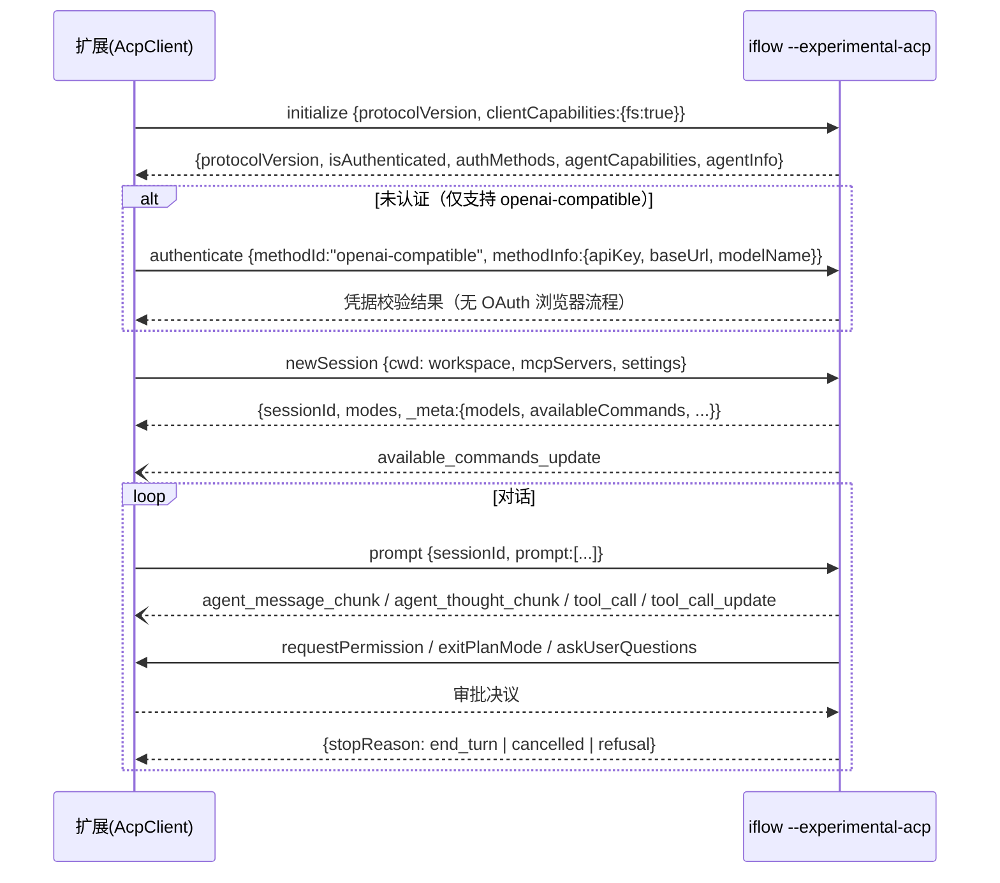

# iFlow CLI VSCode 扩展（图形界面）规划方案

> 目标：为 iFlow CLI 构建一个类似 Claude Code / Codex / Cursor 的 VSCode 图形化 AI 编程助手扩展，复用 iFlow 内核全部能力，且**不修改内核**。

---

## 1. 核心调研结论（基于 `iflow.js.original` 逆向分析）

对根目录 14MB 打包产物（7723 行 ESM bundle，基于 Gemini CLI 架构衍生）分析后，得到对本方案最关键的结论：

**iFlow CLI 已原生内置 ACP（Agent Client Protocol）Agent 模式，扩展无需包装 TUI，可直接以结构化协议对话内核。**

### 1.1 ACP 入口

| 项目 | 结论 |
|---|---|
| 启动参数 | `--experimental-acp`（描述："Starts the agent in ACP mode"） |
| 端口参数 | `--port`（"Port number for ACP server (used with --experimental-acp)"，stdio 之外的可选通道） |
| 传输方式 | 默认 stdio 上的 JSON-RPC 2.0（`process.stdin`/`process.stdout` 转为 Web Stream） |
| 运行时 | Node ESM 单文件，`node iflow.js --experimental-acp` 即可运行 |

### 1.2 ACP Agent 能力清单（`initialize` 返回）

- `protocolVersion`（版本协商，以握手返回为准）
- `agentCapabilities.loadSession: true`（支持恢复历史会话）
- `promptCapabilities: { image: true, audio: false, embeddedContext: true }`（支持图片输入与嵌入上下文）
- `agentInfo`：`iflow-agent`

### 1.3 协议方法表（Agent 侧）

| 方法 | 说明 |
|---|---|
| `initialize` | 握手，返回协议版本/能力/认证方式列表 |
| `authenticate` | 协议层枚举三种方式（`oauth-iflow` / `iflow` API key / `openai-compatible`），但 **iFlow 服务器已关闭，仅 `openai-compatible` 可用**（自备 baseUrl + apiKey + modelName） |
| `newSession` | 建会话，入参含 `cwd / mcpServers / agents / hooks / commands / settings`，返回 `_meta`（models、availableCommands、availableAgents、availableSkills、availableMcpServers） |
| `loadSession` | 按 sessionId 恢复历史（持久化于 `~/.iflow/acp/sessions/*.json`，7 天自动清理） |
| `prompt` | 发送用户输入（text/image 片段），流式返回 |
| `cancel` | 中止当前生成 |
| `setMode` | 权限模式切换，合法值：`default / yolo / smart / plan` |
| `setModel` / `setThink` | 切换模型；开关思考模式及思考配置 |

### 1.4 会话更新事件（Agent → Client 流式推送）

| sessionUpdate | 说明 |
|---|---|
| `agent_message_chunk` | 正文流式片段（Markdown） |
| `agent_thought_chunk` | 思考过程片段（UI 可折叠展示） |
| `tool_call` | 工具调用开始（toolCallId、toolName、title、kind、locations、status: pending） |
| `tool_call_update` | 工具结果（status: completed/failed，content 支持文本或 `{type:"diff", path, oldText, newText}` 结构化 diff） |
| `available_commands_update` | 斜杠命令列表下发 |
| 子代理生命周期 | `AGENT_STARTED / AGENT_COMPLETED / AGENT_FAILED`（task 工具派生的 SubAgent 进度） |

### 1.5 客户端回调（Agent → Client 请求，扩展必须实现）

| 回调 | 说明 |
|---|---|
| `requestPermission` | 工具执行审批；选项含 `allow_once / allow_always / reject_once`；`smart` 模式附风险等级（LOW/MEDIUM/HIGH/CRITICAL）与 AI 审核说明，需渲染风险卡片 |
| `askUserQuestions` | Agent 主动向用户提的结构化问题（多问题/选项） |
| `exitPlanMode` | Plan 模式计划审批（approved / reason 驳回） |
| `fs/*` | 若 `clientCapabilities.fs` 声明，Agent 的文件读写将路由到扩展实现（可结合 VSCode Diff 预览落盘） |

### 1.6 内置工具集（用于 UI 图标/分类渲染）

`read_file`、`write_file`、`replace`、`multi_edit`、`run_shell_command`、`search_file_content`、`glob`、`list_directory`、`read_many_files`、`web_fetch`、`web_search`、`todo_write/todo_read`、`task`（SubAgent）、`ask_user_question`、`exit_plan_mode`、`Skill`、MCP 动态工具。

---

## 2. 集成方式选型

| 方案 | 优点 | 缺点 | 结论 |
|---|---|---|---|
| A. Fork 内核嵌入扩展 | 完全掌控 | 14MB 单文件强耦合、升级困难、维护成本极高 | ❌ |
| B. 仅 Chat Participant（`@iflow`） | 原生聊天体验 | 受 VSCode Chat API 限制（审批卡片/diff/todo 交互受限，无法完全自绘） | ⚠️ 作为补充 |
| C. 终端面板包装 TUI | 零开发 | 体验差，无法结构化交互 | ❌ |
| **D. ACP 子进程 + WebView 自绘 UI** | 内核零侵入、结构化事件齐全、UI 完全掌控、天然支持多客户端 | 需实现协议层 | ✅ **主方案** |

**架构决策：方案 D 为主体，方案 B 为附加集成点。** 这与 Zed 编辑器接入 gemini-cli 的路径一致，协议层可直接参考 `@zed-industries/agent-client-protocol` 的 schema 定义（类型可用，传输层自行实现 stdio JSON-RPC）。

### 2.1 外部参考：DeepSeek Harness

`deepseek-ai/deepseek-harness`（dsh，开发者预览，自带 Web UI/headless/SDK/ACP 四种 profile）：与我们同类的 agent harness（ACP 链路的 agent 侧，非客户端，不可直接复用）。三点借鉴：

1. **印证 ACP 路线**：dsh 也以 ACP 为标准集成面（Zed 之外又一例），生态趋势降低方案 D 的协议风险。
2. **架构模式**：会话日志即事实源（"model-visible means logged"）+ 投影层（增量 fold + `snapshot()` 喂 UI）→ 我们 M1 的状态同步采用同一形态：Extension Host 持有状态，WebView 仅作投影（刷新不丢历史）；事件分域（durable / live / capability seam）参考其划分设计工具事件状态机。
3. **反面提醒**：dsh 明示将有兼容性破坏变更 → 不引入 Cordis/dsh 运行时依赖，扩展仅依赖 iFlow CLI 的 ACP，并坚持 M0 锁定协议快照 fixture 的策略。

---

## 3. 总体架构

```
┌─ VSCode Extension Host (Node.js) ─────────────────────────────┐
│                                                               │
│  AcpProcessManager ──── spawn: node iflow.js --experimental-acp
│        │                  (stdio: JSON-RPC 2.0)               │
│  AcpClient（协议层：握手/方法封装/事件分发/重启恢复）              │
│        │                                                      │
│  ├─ SessionService     会话生命周期、历史恢复、多会话             │
│  ├─ PermissionService  审批队列 → UI 卡片 → 决议回传             │
│  ├─ FsBridge           fs/read_text_file、fs/write_text_file    │
│  ├─ WorkspaceContext   打开文件/选区/@引用 → embeddedContext     │
│  └─ WebviewBridge      postMessage 双向通道（状态同步）          │
│                                                               │
│  ┌─ WebView (React + Vite) ─ 侧边栏聊天面板 ────────────────┐  │
│  │  消息流 / 工具卡片 / Diff 视图 / 审批卡片 / 计划审批        │  │
│  │  输入区（@文件、斜杠命令、图片粘贴、模式/模型选择器）        │  │
│  └──────────────────────────────────────────────────────────┘  │
└───────────────────────────────────────────────────────────────┘
```

分层原则：

- **协议层（acp/）**：纯逻辑、零 VSCode 依赖，可单测、可复用（未来 IDE 插件均可复用）。
- **服务层（services/）**：VSCode API 编排（命令注册、diff 视图、SecretStorage、文件系统桥）。
- **UI 层（webview/）**：React SPA，通过 postMessage 与服务层通信，状态机驱动渲染。

---

## 4. 协议层详细设计

### 4.1 启动握手时序



### 4.2 核心类型定义（`src/acp/protocol.ts` 节选）

```typescript
interface JsonRpcRequest  { jsonrpc: "2.0"; id: number; method: string; params: unknown }
interface JsonRpcResponse { jsonrpc: "2.0"; id: number; result?: unknown; error?: JsonRpcError }
interface JsonRpcNotification { jsonrpc: "2.0"; method: string; params: unknown }

type SessionUpdate =
  | { sessionUpdate: "agent_message_chunk"; content: ContentBlock }
  | { sessionUpdate: "agent_thought_chunk"; content: ContentBlock }
  | { sessionUpdate: "tool_call"; toolCallId: string; toolName: string;
      title: string; kind: ToolKind; status: "pending"; locations?: ToolLocation[] }
  | { sessionUpdate: "tool_call_update"; toolCallId: string; status: "completed" | "failed";
      content?: ToolContent[] }  // content 含 {type:"diff", path, oldText, newText}
  | { sessionUpdate: "plan"; entries: PlanEntry[] }
  | { sessionUpdate: "available_commands_update"; availableCommands: SlashCommand[] };

interface ToolContent =
  | { type: "content"; content: { type: "text"; text: string } }
  | { type: "diff"; path: string; oldText: string | null; newText: string };
```

### 4.3 进程管理（AcpProcessManager）

- **可执行文件定位**（按优先级）：
  1. 配置项 `iflow.cliPath`（显式指定 `node + iflow.js` 或全局 `iflow` 命令）
  2. `PATH` 中的 `iflow` / `iflow.cmd`（Windows 注意 `.cmd` 需通过 shell 解析或 `where` 定位）
  3. npm 全局目录探测（`npm root -g` 下查找）
  4. 均未命中 → 提示用户配置（QuickPick + 文件选择）
- **Windows 专项**：`windowsHide: true`；stdout/stderr 显式 `utf-8`；注意 CLI 内部对 `cmd.exe /d /s /c` 的包装逻辑，参数含空格时必须正确转义。
- **生命周期**：首次激活时惰性启动（`onStartupFinished` 激活、首次打开面板才 spawn）；`deactivate()` 发送 `SIGTERM`，5s 后强杀；进程崩溃 → 指数退避重启（最多 3 次）+ UI 提示。
- **空闲回收**：无活跃会话 30 分钟后回收进程（可配置）。
- **JSON-RPC 帧解析**：按 LSP 风格 `Content-Length` 头或按行 NDJSON——以实测 ACP 输出为准（ACP 标准 NDJSON），解析器做成纯函数便于单测。

### 4.4 FsBridge（fs 能力桥接）

声明 `clientCapabilities.fs` 后，Agent 的文件读写经过扩展：

- `fs/read_text_file`：读 VSCode 工作区文件（尊重 VSCode 的打开编辑器缓冲——若文件在编辑器中有未保存修改，返回缓冲内容）。
- `fs/write_text_file`：写入前生成 diff 预览；`default` 模式下与 `requestPermission` 卡片联动（先审批后落盘）；yolo 模式直接写入并弹"已修改"通知。
- 写入使用 `vscode.workspace.applyEdit`，保留文件在编辑器中的打开状态。

---

## 5. UI / UX 设计

### 5.1 布局

```
┌─────────────────────────────────────────┐
│ [会话选择 ▾]  [模式: smart ▾] [模型 ▾] ⚙ │  ← 顶栏
├─────────────────────────────────────────┤
│  (消息流，虚拟滚动)                        │
│  ┌─ user ─────────────────────────┐     │
│  │ 帮我重构 @src/utils/date.ts     │     │
│  └────────────────────────────────┘     │
│  ┌─ thought ▾ (折叠) ─────────────┐     │
│  └────────────────────────────────┘     │
│  ┌─ tool: replace  ✓ completed ───┐     │
│  │  Editing src/utils/date.ts     │     │
│  │  [diff 预览卡片]  [打开 Diff] [撤销]│   │
│  └────────────────────────────────┘     │
│  ┌─ ⚠ 审批卡片 (smart: 风险 HIGH) ─┐     │
│  │ Running: rm -rf ./build        │     │
│  │ [Allow] [Always Allow] [Reject]│     │
│  └────────────────────────────────┘     │
│  ┌─ plan 审批 ────────────────────┐     │
│  │ [批准执行] [驳回并反馈...]       │     │
│  └────────────────────────────────┘     │
├─────────────────────────────────────────┤
│ [@文件] [图片] [/命令]  ──────── [发送/停止] │  ← 输入区
└─────────────────────────────────────────┘
```

### 5.2 关键交互规范

| 交互 | 设计 |
|---|---|
| 流式渲染 | Markdown 增量解析；代码块语言高亮（shiki）；流式期间滚动锁定（用户上滚即暂停跟随，出现"回到最新"按钮） |
| 工具卡片 | 按 `kind`（read/edit/execute/search/fetch/think）着色 + 图标；`locations` 提供跳转链接 → `vscode.open` + 定位行号 |
| Diff 卡片 | 行内折叠 diff（红/绿），按钮：`Open Diff`（VSCode 原生 diff 编辑器）、`Revert`（oldText 回写） |
| 审批卡片 | 阻塞式置顶；smart 模式显示风险等级徽标（🟢🟡🔴）与 AI 审核理由；倒计时不清除（永久等待用户决议） |
| Plan 审批 | 渲染计划清单（checkbox 样式），`批准` → 回传 approved，`驳回` → 弹输入框收集 reason 回传 |
| askUserQuestions | 渲染为结构化表单（单选/多选/Other 自由输入），回传 answers 映射 |
| 子代理 | task 工具卡片内嵌进度子列表（Agent started/completed/failed 事件流） |
| Todo | todo_write 工具渲染为清单组件，实时勾选状态 |
| 斜杠命令 | `_meta.availableCommands` 驱动输入框自动补全 |
| @文件引用 | 工作区文件 fuzzy 搜索补全，转为 embeddedContext 附到 prompt |
| 图片输入 | WebView 粘贴/拖拽 → base64 → prompt 片段 `{type:"image"}`（`promptCapabilities.image=true` 已支持） |
| 模式切换 | `default/yolo/smart/plan` 分段控件 → `session/set_mode`；plan 模式下输入框提示"仅只读" |
| 中断 | 生成中"发送"按钮变"停止" → `cancel` |

### 5.3 主题与视觉

- 全量使用 VSCode CSS 主题变量（`--vscode-editor-foreground` 等），深浅色自动适配，不做独立配色。
- WebView CSP：`default-src 'none'; script-src 'nonce-xxx'; style-src 'unsafe-inline' vscode-resource:`；Markdown 渲染必须过 DOMPurify 白名单（防提示注入型 XSS——Agent 输出中可能包含恶意 markdown/img）。
- 字体：代码块 `--vscode-editor-font-family`；正文 `--vscode-font-family`。
- 微动效：消息淡入、工具卡片状态切换过渡、流式光标闪烁；动效时长 ≤ 200ms，`prefers-reduced-motion` 降级。
- 长对话性能：虚拟列表（>200 条消息启用），工具结果默认折叠（点击展开，超大输出截断 + "查看全部"打开新 tab）。

---

## 6. VSCode 深度集成点

| 集成 | 说明 |
|---|---|
| Diff 视图 | 工具卡"Open Diff"→ 创建虚拟文档 scheme (`iflow-diff:`) + `vscode.diff(oldUri, newUri)` |
| 选中代码上下文 | 编辑器选区 → 右键菜单 "Ask iFlow" / "Add to iFlow Context" → 附到输入框 |
| 活动文件上下文 | 可开关："自动携带当前打开文件"（token 预算内截断） |
| Chat Participant（附加） | `@iflow` 参与者，把 VSCode Chat 输入转发到同一 ACP 会话，纯文本降级交互 |
| 终端链接 | run_shell_command 结果可 "在终端中重跑" |
| 状态栏 | Agent 运行状态（空闲/生成中/等待审批）、当前模型、模式 |
| SCM 集成 | 会话产生的文件修改列表 → 一键 "Commit with AI message"（调用模型生成 commit message） |
| 多根工作区 | `newSession.cwd` 取首工作区；@引用跨根搜索 |

---

## 7. 配置与安全

### 7.1 配置项（`contributes.configuration`）

| Key | 默认 | 说明 |
|---|---|---|
| `iflow.cliPath` | `""` | CLI 路径（node + js 或可执行文件） |
| `iflow.defaultMode` | `"smart"` | 默认权限模式 |
| `iflow.defaultModel` | `""` | 默认模型（空=Agent 默认） |
| `iflow.apiBaseUrl` | `""` | OpenAI Compatible API base URL（iFlow 服务器已关闭，必填） |
| `iflow.apiModelName` | `""` | OpenAI Compatible 模型名（空=用 baseUrl 服务默认） |
| `iflow.acpArgs` | `[]` | 追加 ACP 启动参数 |
| `iflow.nodePath` | `""` | 自定义 Node 运行时 |
| `iflow.idleTimeoutMinutes` | `30` | 进程空闲回收 |
| `iflow.autoCarryActiveFile` | `false` | 自动携带活动文件上下文 |
| `iflow.thinkEnabled` | `true` | 默认思考模式 |

### 7.2 安全

- **密钥**：OpenAI Compatible 凭据（`apiKey`/`baseUrl`/`modelName`）存 `context.secrets`（SecretStorage），启动时经 `authenticate` 传给 Agent 或注入子进程 env；**禁止**明文写入 settings 或磁盘。（iFlow 服务器已关闭，OAuth 凭据路径已废弃。）
- **审批默认值**：默认 `smart`（非 yolo）；`yolo` 首次启用需模态确认告知风险。
- **命令注入**：扩展侧不拼接 shell 字符串，spawn 一律 `args` 数组传参。
- **WebView 隔离**：`retainContextWhenHidden` 按需；消息流状态存 Extension Host 侧（WebView 仅渲染层，防刷新丢历史）。
- **供应链**：WebView 依赖打包时最小化；DOMPurify 固定版本 + audit。

---

## 8. 工程结构

```
iflow-vscode/
├── package.json              # contributes: viewsContainers/views/commands/configuration/menus
├── esbuild.mjs               # 扩展侧打包（external: vscode）
├── src/
│   ├── extension.ts          # 激活/停用、命令注册
│   ├── acp/                  # 纯协议层（零 vscode 依赖，可独立单测）
│   │   ├── jsonrpc.ts        #   NDJSON 帧 + JSON-RPC 收发
│   │   ├── protocol.ts       #   类型定义（对齐 ACP schema）
│   │   ├── client.ts         #   initialize/newSession/prompt/cancel/setMode...
│   │   └── process-manager.ts#   spawn/重启/回收
│   ├── services/
│   │   ├── session-service.ts
│   │   ├── permission-service.ts
│   │   ├── fs-bridge.ts
│   │   ├── context-service.ts    # @文件/选区/活动文件
│   │   └── auth-service.ts       # OpenAI Compatible 凭据管理（SecretStorage）
│   └── webview-bridge.ts     # postMessage 协议（类型安全）
├── webview/                  # React + Vite 子项目
│   ├── src/App.tsx
│   ├── src/state/            # zustand 状态机：messages/tools/permissions/plan
│   └── src/components/       # MessageList/ToolCard/DiffCard/ApprovalCard/PlanCard/Composer
├── test/
│   ├── acp/                  # 协议单测（fixture：录制的真实 iflow 会话流）
│   ├── mock-acp-agent.ts     # 可编程 Mock Agent（集成测试用）
│   └── suite/                # @vscode/test-electron E2E
└── docs/
```

---

## 9. 里程碑（按交付物划分）

| 阶段 | 交付物 | 验收标准 |
|---|---|---|
| **M0 协议验证** | `acp/` 协议层 + 手动 harness 脚本 | 与真实 `iflow --experimental-acp` 完成握手、prompt、收到流式 chunk 与 tool_call；帧解析单测通过 |
| **M1 最小可用面板** | WebView 侧边栏：消息流式渲染、发送/停止、斜杠命令补全 | 纯对话（无工具）体验完整；中断生效 |
| **M2 工具可视化 + 审批** | 工具卡片、Diff 卡片、审批卡片、Plan 审批、Todo、思考折叠 | default/smart 模式全流程走通：审批→执行→diff 呈现→Revert |
| **M3 认证与配置** | OpenAI Compatible 凭据配置（apiKey/baseUrl/modelName，SecretStorage）、CLI 路径探测、配置面板 | 未配置时引导填凭据；配置后新会话认证通过 |
| **M4 会话管理** | 多会话列表、`loadSession` 历史恢复、会话持久化 UI | 重启 VSCode 后恢复上次会话上下文 |
| **M5 深度集成** | @文件补全、选区上下文、图片输入、Open Diff/Revert、状态栏、Chat Participant | 竞品对齐检查清单全绿 |
| **M6 发布** | vsce 打包、Marketplace 上架、CI（GitHub Actions：lint+test+vsix）、自动更新 | 公开发布 + 内测反馈闭环 |

每个里程碑结束做一次真实项目 dogfooding（用扩展驱动 iflow 完成一个实际需求），作为阶段验收。

---

## 10. 测试策略

1. **协议层单测**：fixture 录制（真实 iflow 会话的 NDJSON 流快照），回放驱动 `AcpClient` 断言状态机。
2. **Mock ACP Agent**：`test/mock-acp-agent.ts` 可编程脚本化事件序列（慢速流式/中途崩溃/权限拒绝/超大输出），E2E 不依赖真实 CLI 与 API 配额。
3. **E2E**（@vscode/test-electron）：激活 → 打开面板 → 发消息 → 断言 DOM 与工作区文件变更。
4. **Windows 矩阵**：CI 增加 `windows-latest`（路径分隔符、.cmd 定位、编码问题是高风险区）。
5. **安全用例**：Markdown XSS 载荷、超长输出、二进制文件 diff。

---

## 11. 风险与对策

| 风险 | 等级 | 对策 |
|---|---|---|
| ACP 为 `experimental`，协议可能随版本变动 | 高 | M0 锁定实测协议快照入 fixture；`initialize` 版本协商 + 特性探测；协议层隔离变化面 |
| CLI 定位失败（用户环境多样） | 中 | 多级探测 + 明确的错误引导 UI |
| Windows stdio 编码/换行/Ctrl+C | 中 | UTF-8 显式声明；取消用协议 `cancel` 而非信号；CI Windows 矩阵覆盖 |
| WebView 长对话卡顿 | 中 | 虚拟列表 + 输出截断 + Extension Host 侧状态存储 |
| 提示注入 → 恶意 Markdown/URL | 中 | DOMPurify + CSP + 外链确认对话框 |
| 子进程泄漏 | 低 | deactivate 强杀 + 孤儿进程检测（pid 文件） |
| 无 `rg` 环境（工具内部依赖降级） | 低 | 工具在 Agent 侧处理，扩展不介入 |

---

## 12. M0 实测结论（2026-09-05，CLI 0.5.19，已验证）

M0 已完成：`iflow-vscode/` 工程内实现协议层（`src/acp/jsonrpc.ts`、`protocol.ts`、`client.ts`、`cli-locator.ts`），17 个单测/集成测试通过，harness 对真实 CLI 完成握手→建会话→流式对话全流程，wire 日志录制于 `iflow-vscode/test/fixtures/`。原"开放问题"实测回答如下：

1. **协议版本 = 1**；wire 方法名与 ACP 标准一致：`initialize` / `session/new` / `session/prompt` / `session/update`（通知）。`initialize` 响应额外含 **`isAuthenticated: true`** 字段（未认证时扩展可直接据此走认证流程）。
   > **⚠ 前提变更（用户确认）**：iFlow 官方服务器已关闭，`oauth-iflow` / `iflow` 两种认证方式已不可用，**仅 `openai-compatible` 可用**（自备 OpenAI 兼容 baseUrl + apiKey + modelName）。M0 fixture 中的三种 authMethods 列表为协议层枚举，不代表可用性。
2. **stdio 通道为 NDJSON**（每行一个 JSON-RPC 消息）；CLI 启动 banner 只出现在 stderr，stdout 协议流干净。
3. **模型列表在 `newSession` 响应 `_meta.models`**，结构为 `{currentModelId, availableModels:[{id, name, description, capabilities.thinking}]}`（字段是 `id` 非 `value`）；实测返回 9 个模型。`models` 不为空，方案早期"可能为空"的疑虑解除。
4. **`_meta.availableCommands`** 实测 6 个（init/compress/directory/update/docs/commit），带 `_meta.scope`（project|global）与 `altName` 扩展；且会话开始后 Agent 会主动推送 `available_commands_update`。
5. **`~/.iflow/acp/sessions` 持久化已确认存在**（5994 字节历史会话文件）；扩展仍应走 `session/load` 恢复，不直接读文件。
6. CLI 定位：npm `.cmd` shim 以 `%dp0%`/`%~dp0` 变量引用 `@iflow-ai/iflow-cli/bundle/entry.js`，`cli-locator.ts` 已实现变量展开 + `npm root -g` 兜底，实测自动定位成功。
7. 仍待 M2 实测：`session/request_permission` 选项结构、`tool_call` diff 内容块、`session/set_mode`、`session/set_think`、子代理事件。

**遗留问题**：`session/cancel` 中断语义、tool_call 流式进度（in_progress 状态是否推送）在 M1/M2 用真实工具调用验证。

---

## 13. 下一步行动清单

1. ~~在本仓库新建 `iflow-vscode/` 扩展工程~~（M0 完成）
2. ~~M0：实现 `jsonrpc.ts` + `client.ts`，跑通握手与一轮对话，录制 fixture~~（M0 完成）
3. ~~按第 4.2 节把协议类型补全为独立 `protocol.ts`~~（M0 完成，已按实测修正模型/命令结构）
4. M1：搭建 WebView 骨架（Vite + React + zustand），打通 postMessage 通道，实现消息流式渲染面板。
